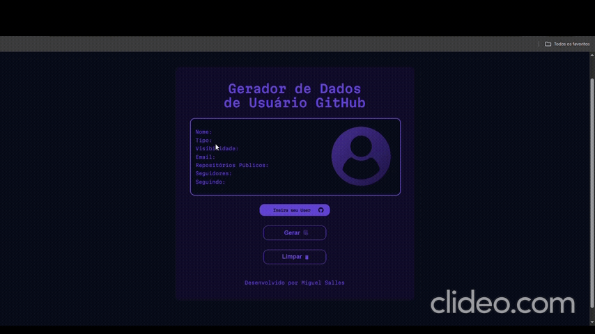

### 🎲 Consulte os seus dados do <strong style = "color: red">GitHub!</strong> com apenas um clique!

### 📍 <strong>Objetivos do Projeto</strong>
<ul>
    <li>Testar minhas habilidades com async/await e promises no JS.</li>
    <li>Testar minhas habilidade em HTML e CSS responsivo.</li>
    <li>Permitir que você consulte seus dados de maneira simples e prática!</li>
</ul>

### ⚙ <strong>Funcionalidades do Projeto</strong>
<ul>
    <li>Utilização da <strong>API GitHub para buscar e tratar os dados.</strong></li>
    <li>Design <strong>responsivo visando o conforto para o usuário.</strong></li>
    <li>Função de <strong>gerar dados.</strong></li>
    <li>Função para <strong>limpar dados.</strong></li>
    <li>Utilização de <strong>promises, async/await.</strong></li>
    <li>Utilização de <strong>try/catch para tratamento de erros.</strong></li>
    <li>Modularização do código <strong>para melhor entendimento.</strong></li>
</ul>

### 📺 Uma pequena demonstração do Projeto

### 💻 Tecnologias Utilizadas

